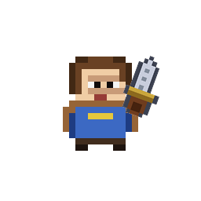
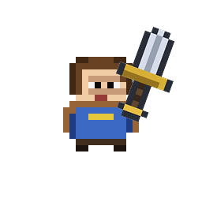
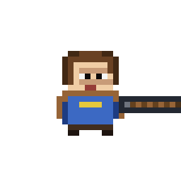
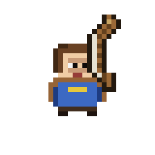
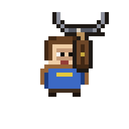
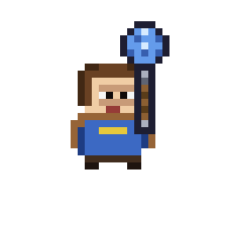
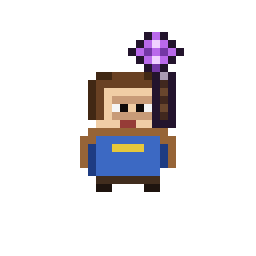

# Оружие

Data-driven через кастомный `Resource` — `WeaponResource` (class_name зарегистрирован глобально).

Модель разделена на **стили** и **типы атаки** — фундамент для warrior / archer / mage игровых стилей. После fantasy roster overhaul в проекте семь оружий: 3 warrior (Dagger, Short Sword, Spear), 2 archer (Short Bow, Crossbow), 2 mage (Wand, Apprentice Staff). Firearm-контент (Pistol, Shotgun) удалён.

## `WeaponResource` (`resources/weapon_resource.gd`)

### Identity

| Поле | Тип | Смысл |
|------|-----|-------|
| `id` | `String` | Уникальный slug (например `short_sword`, `wand`) |
| `style` | `enum` | `warrior` / `archer` / `mage` |
| `attack_type` | `enum` | `melee_arc` / `melee_thrust` / `projectile` / `spell_projectile` / `spell_area` |
| `tier` | `int` | Уровень оружия (пока всё tier=1) |
| `tags` | `Array[String]` | Свободные теги для upgrade cards и фильтров |
| `display_name` | `String` | i18n ключ (UPPER_SNAKE_CASE) |
| `icon_texture` | `Texture2D` | 16×16 иконка на `WeaponPickup` |
| `icon_modulate` | `Color` | Оттенок иконки в мире (по умолчанию `WHITE`) |

### Общие attack stats

| Поле | Тип | Смысл |
|------|-----|-------|
| `damage` | `int` | Урон одного попадания |
| `attack_interval` | `float` | Cooldown между атаками (сек) |
| `attack_range` | `float` | Информативная дистанция удара (для docs/HUD). Не `range` — то встроенная функция GDScript |

### Projectile stats (для `projectile`, `spell_projectile`, `spell_area`)

| Поле | Тип | Смысл |
|------|-----|-------|
| `projectile_scene` | `PackedScene` | Кастомная сцена снаряда. null → default `bullet.tscn` (fallback для тестов) |
| `projectile_speed` | `float` | Скорость |
| `projectile_lifetime` | `float` | Живучесть |
| `projectile_color` | `Color` | `modulate` для visual. Обычно `WHITE` — у каждого снаряда свой цветной sprite |
| `projectiles_per_attack` | `int` | Сколько снарядов за одну атаку |
| `spread_angle_deg` | `float` | Полный угол разброса |
| `pierce` | `int` | Через сколько врагов пробивает (0 — не пробивает) |
| `projectile_spawn_distance` | `float` | Смещение точки спавна вдоль direction, чтобы снаряд выходил от наконечника оружия |
| `projectile_spawn_lateral_offset` | `float` | Боковое смещение (перпендикулярно direction) |

### Melee stats (для `melee_arc`, `melee_thrust`)

| Поле | Тип | Смысл |
|------|-----|-------|
| `arc_degrees` | `float` | Ширина дуги для arc-атак |
| `hitbox_width` | `float` | Ширина hitbox'а перед игроком |
| `hitbox_length` | `float` | Длина hitbox'а перед игроком |
| `windup_time` | `float` | Задержка перед активной фазой |
| `active_time` | `float` | Как долго hitbox бьёт |
| `recovery_time` | `float` | Cooldown после активной фазы |
| `knockback` | `float` | Отбрасывание врагов |

### Magic v1 (заготовка, не расходуется)

| Поле | Тип | Смысл |
|------|-----|-------|
| `mana_cost` | `int` | В v1 всегда 0 (ману ещё не завели) |
| `status_effect` | `String` | Планируемый эффект (`burn`, `frost`, ...) |
| `area_radius` | `float` | Для `spell_area` |

Legacy fallback fields (`fire_interval`, `bullet_*`, `bullets_per_shot`) удалены — все семь активных `.tres` задают современные поля напрямую. `get_attack_interval()` / `get_projectile_*()` остаются публичным API для WeaponStats и bullet.

## Warrior — melee_arc / melee_thrust

Ближний бой реализован через `MeleeHitbox` (`scenes/player/melee_hitbox.tscn`) — `Area2D`, форма которого зависит от `attack_type`:

- **`melee_arc`** — круговой сектор с углом `arc_degrees`, радиусом `hitbox_length`. Технически это `CircleShape2D(radius = hitbox_length)`, стоящий в позиции игрока, плюс angular-filter в `_try_hit`: тело попадает под удар только если его локальный угол (в системе координат, повёрнутой на `direction.angle()`) находится в `±arc_degrees/2`. `hitbox_width` игнорируется — форма секторная.
- **`melee_thrust`** — прямоугольник `RectangleShape2D(size = hitbox_length × hitbox_width)`, сдвинутый на `hitbox_length/2` вперёд от игрока. Никакого angular-фильтра, вся ловушка в самой форме.

**Общее поведение:**
- WeaponController при `attack_type ∈ {melee_arc, melee_thrust}` инстансирует `melee_hitbox_scene` и вызывает `hitbox.configure(source, direction, damage, length, width, active_time, knockback, attack_type, arc_degrees)` **до** `add_child` — конструирует `CollisionShape2D` под нужную форму и позиционирует / поворачивает Area2D.
- На первом `_physics_process` сканирует `get_overlapping_bodies()` (враги, стоявшие внутри hitbox'а на момент spawn'а, не выдадут `body_entered`).
- В течение `active_time` слушает `body_entered` для новых overlap'ов.
- Каждого enemy бьёт максимум один раз за swing (`_hit_targets` как set).
- **LoS-фильтр (`_has_line_of_sight_to`)** — прежде чем нанести урон, делаем raycast от источника удара к позиции врага через `LineOfSight.is_clear`. Если между ними `StaticBody2D` (стена) — удар не наносится, даже если враг геометрически в секторе / прямоугольнике.
- После `active_time` — `monitoring = false`, hitbox больше не наносит урон, но остаётся в дереве и продолжает рендериться.
- По истечении `_visual_life = max(active_time, MIN_VISUAL_LIFE = 0.16)` — `queue_free`.

### Роли warrior-оружия

| Оружие | Damage | Interval | Base DPS | Reach | Arc | Knockback |
|--------|-------:|---------:|---------:|------:|----:|----------:|
| Dagger | 1 | 0.28 | 3.57 | 24 | 60° | 10 |
| Short Sword | 2 | 0.38 | 5.26 | 34 | 80° | 40 |
| Spear | 2 | 0.48 | 4.17 | 58 | thrust | 30 |

- **Dagger** — минимальный reach и knockback, высокая частота атак, лучший приход от flat damage. Кинжал в roster'e, а не старт по умолчанию.
- **Short Sword** — универсальное оружие, лучший базовый DPS. Стартовое (`GameState.DEFAULT_WEAPON`).
- **Spear** — самый длинный reach и безопасный thrust. Не получает Sweeping Blade (см. Style upgrade).

Все три warrior-оружия используют один `melee_hitbox.tscn` через `attack_type` (Sword/Dagger — `melee_arc`, Spear — `melee_thrust`).

### Анимация hitbox'а (процедурный `_draw`)

Каждый MeleeHitbox сам рисует «след» удара — не сплошную заливку области урона (она перекрывала бы врага), а лёгкие световые штрихи, читаемые как ветер от клинка:

- **`melee_arc`** — два дугообразных «ветерка» вокруг направления атаки: внутренний на радиусе `hitbox_length × ARC_INNER_RADIUS_RATIO` (~0.55) и внешний на `× ARC_OUTER_RADIUS_RATIO` (~0.92). Каждый ветерок покрывает `arc_degrees × ARC_STREAK_COVERAGE` (~85% сектора) — на концах остаются короткие «хвосты», а не резкий обрыв. Внешний штрих светлее и длиннее, читается как кромка замаха; внутренний глухой, поддерживает силу удара.
- **`melee_thrust`** — два горизонтальных штриха выше и ниже древка копья (`± hitbox_width × THRUST_STREAK_OFFSET_RATIO`, длина `× THRUST_STREAK_LENGTH_RATIO`), плюс треугольный «наконечник» у переднего края. Читается как свист копья при уколе.

Альфа-канал даёт burst-фазу: fade-in первые 15% `_visual_life`, hold 35%, fade-out оставшееся. Хитбокс перестаёт наносить урон после `active_time` (`monitoring = false`), но продолжает рендериться до `_visual_life = max(active_time, MIN_VISUAL_LIFE = 0.16)` — так игрок видит короткое затухание уже после того, как удар прошёл.


### Style upgrade cards

Warrior-карты (см. `upgrades.md`):

| Карта | Эффект | Max stacks | Применяется к |
|-------|--------|-----------:|---------------|
| Heavy Strike | `+1 damage` | 3 | всем warrior-оружиям |
| Long Reach | `×1.10 hitbox_length` | 2 | всем warrior-оружиям |
| Pushback | `+20 knockback` | 2 | всем warrior-оружиям |
| Sweeping Blade | `×1.15 arc_degrees` | 2 | только `melee_arc` (Dagger, Short Sword) |

**Sweeping Blade и attack_type фильтр.** У `PlayerUpgradeResource` есть поля `required_attack_types` / `excluded_attack_types`. Sweeping Blade объявляет `required_attack_types = ["melee_arc"]` — генератор офферов не предлагает её игроку с копьём (`melee_thrust`), потому что карта расширяла бы `arc_degrees`, которого у thrust нет. Другие warrior-карты остаются доступны для Spear.

**Общий cap для дуги** — `MAX_ARC_DEGREES = 179°`: полный круг «съел бы» направление атаки, что визуально и геймплейно неоднозначно.

Расчёты Heavy Strike при max стеках:

| Оружие | Damage | Interval | DPS |
|--------|-------:|---------:|----:|
| Dagger | 4 | 0.28 | 14.29 |
| Short Sword | 5 | 0.38 | 13.16 |
| Spear | 5 | 0.48 | 10.42 |

Кинжал обгоняет меч по максимальному DPS не более чем на ~10% и платит самым коротким reach, узкой дугой, слабым knockback. Копьё сохраняет преимущество безопасности и дистанции.

### Ресурсы warrior-оружия

- **Dagger** (`dagger.tres`) — `style = warrior`, `attack_type = melee_arc`, `damage = 1`, `attack_interval = 0.28`, `attack_range = 24`, `arc_degrees = 60`, `hitbox_length = 24`, `knockback = 10`. i18n: `WEAPON_DAGGER`.
- **Short Sword** (`short_sword.tres`) — `style = warrior`, `attack_type = melee_arc`, `damage = 2`, `attack_interval = 0.38`, `attack_range = 36`, `arc_degrees = 80`, `hitbox_length = 34`, `knockback = 40`. i18n: `WEAPON_SHORT_SWORD`.
- **Spear** (`spear.tres`) — `style = warrior`, `attack_type = melee_thrust`, `damage = 2`, `attack_interval = 0.48`, `attack_range = 56`, `hitbox_length = 58`, `hitbox_width = 18`, `knockback = 30`. i18n: `WEAPON_SPEAR`.

## Archer — projectile

Классические ranged-оружия используют собственные projectile scenes (см. «Player projectile identity» ниже) через `WeaponController._attack_projectile`. Идентифицируются через `style = archer`, `attack_type = projectile` и v2-поля (`projectile_speed / lifetime / color / pierce`).

**Pierce.** Поле `pierce: int` в `WeaponResource`. Bullet `apply_weapon` копирует его в `_pierce_remaining`. При попадании во врага:
1. если враг уже был в `_hit_bodies` (Area2D может слать `body_entered` повторно) — пропускаем;
2. иначе наносим `damage`, отмечаем в `_hit_bodies`;
3. если `_pierce_remaining > 0` — decrement, пуля летит дальше;
4. иначе — `queue_free`.

**Стены гасят пулю независимо от pierce.** Если `body_entered` пришёл от тела без `take_damage` (единственные такие тела в сцене — `StaticBody2D` стен из `floor.gd`), пуля сразу `queue_free`, не тратя pierce.

### Short Bow (`short_bow.tres`)

`style = archer`, `attack_type = projectile`, `damage = 1`, `attack_interval = 0.32`, `projectile_speed = 260`, `projectile_lifetime = 1.2`, `spread_angle_deg = 2`, `pierce = 0`. Быстрый и надёжный ranged.
i18n: `WEAPON_SHORT_BOW`.

### Crossbow (`crossbow.tres`)

`style = archer`, `attack_type = projectile`, `damage = 3`, `attack_interval = 0.75`, `projectile_speed = 300`, `projectile_lifetime = 1.4`, `spread_angle_deg = 0`, `pierce = 1`. Медленнее, но сильнее и пробивает одного врага насквозь.
i18n: `WEAPON_CROSSBOW`.

## Mage — spell_projectile

Магические оружия v1 — без маны и без сложных заклинаний. Отличаются от archer только identity (`style = mage`, `attack_type = spell_projectile`) и визуально (свои `projectile_color`). WeaponController обрабатывает `spell_projectile` тем же путём, что и `projectile` — общий `_attack_projectile()`.

**mana_cost = 0** в v1 — поле-заготовка. Реальная система маны, spellbook и elemental статусы — backlog.

### Apprentice Staff (`apprentice_staff.tres`)

`style = mage`, `attack_type = spell_projectile`, `damage = 3`, `attack_interval = 0.62`, `projectile_speed = 210`, `projectile_lifetime = 1.2`, `spread_angle_deg = 0`. Сине-голубой снаряд, медленный тяжёлый cast.
i18n: `WEAPON_APPRENTICE_STAFF`.

### Wand (`wand.tres`)

`style = mage`, `attack_type = spell_projectile`, `damage = 1`, `attack_interval = 0.24`, `projectile_speed = 230`, `projectile_lifetime = 1.0`, `spread_angle_deg = 4`. Пурпурный, лёгкий частый cast.
i18n: `WEAPON_WAND`.

## Player projectile identity

Каждое ranged/magic оружие использует собственную projectile scene с узнаваемым sprite'ом и shape'ом. Общий `bullet.tscn` остаётся как safety-fallback для тестов и для оружия без явного `projectile_scene`.

| Оружие | Projectile scene | Sprite (px) | Shape | Rotation | Spawn distance |
|--------|------------------|------------:|-------|----------|---------------:|
| Short Bow | `scenes/bullets/player_arrow.tscn` | 12×5 деревянная стрела с оперением | `RectangleShape2D(12×4)` | вдоль direction | 18 |
| Crossbow | `scenes/bullets/player_crossbow_bolt.tscn` | 9×5 короткий стальной bolt | `RectangleShape2D(9×4)` | вдоль direction | 20 |
| Wand | `scenes/bullets/player_wand_orb.tscn` | 7×7 компактный пурпурный orb | `CircleShape2D(3.0)` | нет (круглый) | 18 |
| Apprentice Staff | `scenes/bullets/player_staff_orb.tscn` | 11×11 крупный сине-голубой orb | `CircleShape2D(5.0)` | нет (круглый) | 20 |

Значения `projectile_spawn_distance` подобраны под aim-aligned pose: сумма `held_hand_offset.x` (5 px) и длины sprite'а оружия (~16 px) — снаряд рождается у tip оружия, а не в центре игрока.

Все четыре сцены используют один скрипт `scenes/bullets/bullet.gd` — он наносит урон **врагам**, не игроку. Enemy-projectiles (`arrow_bullet.tscn`, `magic_bolt_bullet.tscn`, `dark_orb_bullet.tscn`) используют другой скрипт (`enemy_bullet.gd`) с обратной damage-логикой и не должны переиспользоваться для оружия игрока.

### `bullet.gd` fields (v2)

- `rotate_with_direction: bool` — вытянутые снаряды (стрела, болт) поворачиваются вдоль direction, чтобы наконечник смотрел в сторону полёта. Круглые orbs держат `rotation = 0`.
- `rotation_offset: float` — смещение rotation (радианы) для случаев, когда исходный sprite нарисован не «вправо».
- `_pending_visual_color: Color` — кешированный projectile color. `WeaponController` выставляет direction и `apply_weapon_stats(...)` **до** `add_child`, но `@onready _visual` в этот момент ещё `null` — тогда modulate падал в никуда. `_ready` читает кеш и применяет `modulate` уже при существующем `_visual`.

### Spawn origin

`WeaponController._attack_projectile` считает spawn point от игрока:

```gdscript
spawn_origin =
    player.global_position
    + direction * weapon.projectile_spawn_distance
    + direction.orthogonal() * weapon.projectile_spawn_lateral_offset
```

Для оружия без явного `projectile_spawn_distance` (`= 0`) поведение идентично старому — снаряд рождается в центре игрока. Ненулевое значение сдвигает spawn на расстояние оружия — стрела выходит от лука, orb — от кончика жезла.

`direction.orthogonal()` направлен на 90° влево от direction, поэтому положительный `projectile_spawn_lateral_offset` смещает spawn влево от аимом. По умолчанию 0 — все текущие оружия симметричные.

## Общий bullet.tscn (fallback / тесты)

`Area2D` с `Sprite2D` (радиус 2). Метод `apply_weapon(weapon)` копирует `damage / speed / lifetime / projectile_color` из ресурса. Используется как safety-fallback, если у оружия не задан `projectile_scene`, и как база для тестов, независимых от конкретной projectile identity.

**Поведение:** движется `direction * speed`; при `body_entered` игнорит группу `player`, наносит `damage` через `take_damage` если у ноды есть метод, и уничтожается. Self-destroy через `lifetime`. Не-урон-цели (StaticBody2D стен) гасят пулю независимо от pierce.

Скрипт: `scenes/bullets/bullet.gd`.

## Атака игрока

Атака вынесена из `player.gd` в `WeaponController` (child-нода `Player/WeaponController`, скрипт `scenes/player/weapon_controller.gd`). Player только держит `equipped_weapon` и на каждый tick вызывает `_weapon_controller.try_attack(equipped_weapon, get_global_mouse_position())` — controller сам решает как атаковать по `weapon.attack_type`.

**WeaponController отвечает за:**
- cooldown (`_cooldown` тикает в `_process`, `is_ready()` возвращает готовность);
- projectile spawning для `projectile` / `spell_projectile`;
- melee hitbox spawning для `melee_arc` / `melee_thrust`;
- fallback на `default_projectile_scene` (= `bullet.tscn` из player.tscn) если `weapon.projectile_scene` не задан.

**`try_attack(weapon, target_global_position) → bool`** — возвращает `true` если атака действительно запущена (weapon не null, cooldown готов, direction не нулевой). Cooldown ставится ТОЛЬКО на успешной атаке — failed attempt не залипает на cooldown'е.

## Модель оружия в руке игрока

`player.tscn` содержит дочерний `Sprite2D` **Weapon**. Визуал разделён на **icon** (мировой pickup + HUD) и **held** (Sprite2D в руке). Fallback: если `held_texture` не задан — используется `icon_texture` (текущие 7 .tres используют fallback, отдельного held-спрайта нет).

### Held-metadata полей WeaponResource

| Поле | Тип | По умолчанию | Смысл |
|------|-----|--------------|-------|
| `held_texture` | `Texture2D` | null | Отдельный sprite для «в руке». Fallback → `icon_texture` |
| `held_sprite_offset` | `Vector2` | `(0, 0)` | Явный pivot. `(0,0)` → auto `(0, -h/2)` (рукоять внизу PNG) |
| `held_scale` | `Vector2` | `(1, 1)` | Масштаб. `(0.7, 0.7)` у Dagger — визуально меньше меча |
| `held_hand_offset` | `Vector2` | `(5, 3)` | Позиция Sprite2D от корпуса игрока |
| `held_rest_rotation` | `float` | `0.0` | Rest-угол для side-rest поз. Умножается на `_facing` |
| `held_aim_aligned` | `bool` | `false` | true → оружие следует курсору. Aim-aligned оружия: копьё, лук, арбалет, жезл, посох |
| `held_aim_rotation_offset` | `float` | `0.0` | Поправка rotation для aim-aligned sprites, нарисованных не «вправо» |

### Rest pose (без aim) — `_apply_facing_visuals`

`position = (held_hand_offset.x * _facing, held_hand_offset.y)` — оружие с той стороны, куда смотрит игрок.
`flip_h = _facing < 0` — при взгляде влево sprite отражается по горизонтали, чтобы асимметричные оружия (лук с дугой на одной стороне) читались правильно.

**Rest rotation** (`_get_rest_rotation`):
- Явный `held_rest_rotation != 0` → `held_rest_rotation * _facing`. Sword (0.35), Dagger (0.35).
- `melee_arc` / `melee_thrust` без явного значения → `DEFAULT_MELEE_REST_ANGLE * _facing` (0.35 rad ≈ 20°).
- `projectile` / `spell_projectile` → `0.0`. Лук/посох в rest вертикально.

Rest-поза применяется на `equip()` и `face()` — детерминирована по `_facing`, не требует aim.

### Aim-tracking pose — `_update_weapon_pose(aim_direction)` (каждый physics tick)

Для aim-aligned оружий (`held_aim_aligned = true`):
```
rotation = aim_direction.angle() + held_aim_rotation_offset
```

Все 5 aim-aligned оружий (spear, bow, crossbow, wand, apprentice_staff) задают `held_aim_rotation_offset = π/2` — их sprites нарисованы «вверх», поэтому +90° разворачивает к горизонтали вправо при aim right.

Во время активного attack tween (`_swing_tween.is_valid()`) aim-tracking пропускается — анимация приоритетнее.

### Z-order layering — `_update_weapon_layering(aim_direction)`

При прицеливании вверх оружие уходит **за** спрайт игрока:
```
show_behind_parent = aim_direction.y < WEAPON_BEHIND_Y_THRESHOLD  # -0.25
```

Порог даёт гистерезис у горизонтали, чтобы sprite не мерцал при aim ровно вбок.

### Icon vs held

- При `_ready` и `equip(weapon)` — `_apply_weapon_visual` подставляет `weapon.get_held_texture()`, `modulate = weapon.icon_modulate`, `scale = weapon.held_scale`, затем зовёт `_apply_facing_visuals`.
- Без equipped weapon (или без held texture) — Weapon-нода скрыта.
- Все семь оружий имеют собственные 16×16 pixel-art спрайты, `icon_modulate = WHITE` (спрайт сам несёт цвет).
- Dagger генерируется `tools/gen_item_sprites.py`, остальные шесть — `tools/gen_weapon_sprites.py`.

### Внешний вид игрока с каждым оружием

Композит «игрок + иконка оружия» в rest-позе (facing right).
- **Side-rest** (Dagger, Short Sword) — наклонены на `held_rest_rotation ≈ 20°` наружу от игрока.
- **Aim-aligned в rest без aim** (Spear, Short Bow, Crossbow, Wand, Apprentice Staff) — sprite направлен вправо (`held_aim_rotation_offset = π/2`).
- Dagger уменьшен через `held_scale = (0.7, 0.7)` — визуально короче меча.

Генератор — `tools/gen_player_weapon_showcase.py`, парсит те же поля из `.tres`, что использует движок в `_apply_weapon_visual` + `_apply_facing_visuals`.

| Оружие | Стиль | Attack type | Внешний вид |
|--------|-------|-------------|-------------|
| Dagger | warrior | `melee_arc` |  |
| Short Sword | warrior | `melee_arc` |  |
| Spear | warrior | `melee_thrust` |  |
| Short Bow | archer | `projectile` |  |
| Crossbow | archer | `projectile` |  |
| Apprentice Staff | mage | `spell_projectile` |  |
| Wand | mage | `spell_projectile` |  |

При изменении спрайта игрока, спрайта оружия, констант hand-offset / rest-angle или добавлении нового оружия — перегенерировать через `python3 tools/gen_player_weapon_showcase.py` и закоммитить обновлённые PNG в тот же коммит. См. `.claude/rules/60-player-weapon-showcase.md`.

## Анимация атаки

`player.play_attack_visual(target_pos, weapon)` диспатчит по `attack_type` — у каждого типа своя анимация. Предыдущий tween убивается через `.kill()` перед стартом нового.

| Attack type | Анимация | Длительность (out+back) |
|-------------|----------|-------------------------|
| `melee_arc` | Выпад корпуса + широкий swing оружия по дуге на `WEAPON_SWING_ANGLE ≈ 99°` | 60 + 120 ms |
| `melee_thrust` | Выпад корпуса + оружие идёт вперёд на `THRUST_DISTANCE = 8 px` без вращения | 50 + 100 ms |
| `projectile` | Recoil: корпус и оружие сдвигаются назад на `RECOIL_DISTANCE = 3 px` без вращения | 40 + 100 ms |
| `spell_projectile` / `spell_area` | Cast pulse: короткий сдвиг корпуса вперёд + оружие `scale × CAST_SCALE_MULTIPLIER = 1.2` | 60 + 100 ms |

Знак swing angle для `melee_arc` умножается на `_facing` — удар всегда идёт «в сторону цели»: по часовой при facing right, против при left. Через пивот на рукояти читается как рубящий удар.

**Melee arc** (Sword, Dagger) — единственный тип, крутящий rotation. Остальные типы двигают только position/scale, оставляя rotation в rest/aim-tracked состоянии.

**Projectile spawn:**
- количество = `weapon.get_projectiles_per_attack()`;
- при count > 1 — равномерный spread от `-spread/2` до `+spread/2`;
- при count == 1 и spread > 0 — случайное отклонение `±spread/2`;
- каждая пуля вызывает `apply_weapon(weapon)` — тот сам подхватывает `damage` / `get_projectile_speed()` / `get_projectile_lifetime()` / `get_projectile_color()`.

Смена оружия — через `WeaponPickup` (см. `pickups.md`); стартовое оружие после смерти сбрасывается в `DEFAULT_WEAPON = short_sword`.
