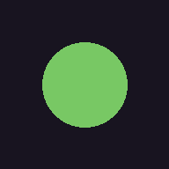
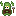
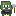
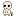
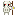
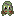
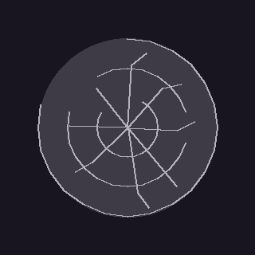
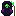
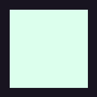
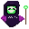

# Бестиарий

Всё, что бегает по этажам и хочет тебя убить.

Числа контактного урона — базовые; на глубоких этажах через `Balance.scaled_damage` они растут. HP — базовое здоровье, тоже масштабируется. Скорость — px/сек.

## Малый слизень

| Параметр | Значение |
|----------|----------|
| HP | 1 |
| Скорость | 36 |
| Контактный урон | 1 |

Простейший ранний враг — мелкий, слабый, гибнет с одного удара. Не почкуется и не распадается при смерти. Появляется как самостоятельный монстр на ранних этажах и как «продукт» размножающегося взрослого слизня.

## Слизень (взрослая форма)

| Параметр | Значение |
|----------|----------|
| HP | 3 |
| Скорость | 35 |
| Контактный урон | 1 |

Взрослая размножающаяся форма. Опасен не сам по себе, а тем, что **делится**: при агре через 4 секунды рядом появляется **малый слизень** (не ещё один взрослый — цепь конечная). При смерти взрослый распадается на **двух малых** — быстрая куча слабых противников вместо одного среднего.

Также каждый слизень **прыгает** — во время `HOP`-фазы движется рывком, между рывками стоит. Стрелять в него между прыжками легче, но целиться на бегу неудобно.

## Гоблин

| Параметр | Значение |
|----------|----------|
| HP | 4 |
| Скорость | 55 |
| Контактный урон | 2 |

Быстрый и кусачий. Один гоблин — не проблема, стая — уже да: догоняет и наносит **2** контактного урона за касание. Держи дистанцию, стреляй на подходе.

## Орк

| Параметр | Значение |
|----------|----------|
| HP | 8 |
| Скорость | 28 |
| Контактный урон | 3 |

Медленный танк. Терпит много попаданий, бьёт больно. Кайтить кругами вокруг угла — рабочая тактика.

## Скелет

| Параметр | Значение |
|----------|----------|
| HP | 3 |
| Скорость | 50 |
| Контактный урон | 2 |

Быстрый и с оружием — на глубоких этажах несёт кинжалы или мечи разного качества, что добавляет ему урона при выпаде. Держит короткую атакующую дистанцию, делает свинг оружия при ударе (визуально видно замах — можно попытаться отскочить).

## Скелет-лучник

| Параметр | Значение |
|----------|----------|
| HP | 2 |
| Скорость | 30 |
| Урон стрелы | 1 |
| Интервал выстрела | 1.5 с |

Хлипкий, но опасный на расстоянии — старается держать дистанцию и стрелять. На глубоких этажах меняет стрелы (деревянные/железные), стрелы визуально отличаются по спрайту.

Не давай ему занять «удобную» позицию у стены — он там будет спокойно расстреливать тебя.

## Зомби

| Параметр | Значение |
|----------|----------|
| HP | 6 |
| Скорость | 22 |
| Контактный урон | 3 |

Медленный, но **раз в 6 секунд роняет ядовитое облако** прямо у своих ног. Облако висит 4 секунды и накладывает статус «отравлен» — см. [эффекты](effects.md#яд).

Не пробегай через место, где недавно стоял зомби — облако невидимо на первый взгляд, но эффект липнет надолго.

## Паук

| Параметр | Значение |
|----------|----------|
| HP | 1 |
| Скорость (патруль / рывок) | 25 / **220** |
| Контактный урон | 2 |
| Тактика | Плюёт паутиной + рывок |

Хилый (1 hp), но опасный сразу с двух сторон. Цикл поведения:
1. **Патруль (`WATCH`)** — медленно бродит по комнате (25 px/сек), пока ты не появился в его perception-радиусе.
2. **Заряд (`WAITING`, ~1.2 с)** — увидел тебя, замирает, плюёт паутиной в сторону твоего последнего положения. Визуально «пружинится» оранжевым — окно на реакцию.
3. **Рывок (`CHARGING`, ~0.9 с)** — стремительный рывок к тому же месту со скоростью **220** px/сек. В контакт наносит **2** урона.

Ты умрёшь не от плевка (это только замедление), а от рывка, если стоишь в паутине. См. [эффекты — паутина](effects.md#паутина).

Пауки играют на контроле пространства — не задерживайся в приземлившейся паутине.

## Лич

| Параметр | Значение |
|----------|----------|
| HP | 3 |
| Скорость | 25 |
| Контактный урон | 1 |
| Способность | Призывает скелетов |

Слабый в бою, но **призывает миньонов** — обычных скелетов рядом с собой. Пока лич живёт, свита не кончается. Убей лича первым, дальше добивай оставшихся.

Отдельная сложность: лич **стреляет с упреждением** — не туда, где ты сейчас, а туда, где ты успеешь оказаться к моменту подлёта пули. Бег по прямой = гарантированный хит. Ломать линию бегством + резким сдвигом в сторону — вот что помогает.

Во время каста лич пульсирует визуально — можно услышать/увидеть, когда откроется окно урона.

## Некромант (босс)

| Параметр | Значение |
|----------|----------|
| HP | 30 |
| Скорость | 25 |
| Контактный урон | 3 |
| Способность | Призывает свиту и стреляет залпами |

Финальный босс — жирный, стреляет пулевыми залпами по кругу, а между залпами призывает свиту (5 скелетов за один каст). Первый каст стартует сразу при входе в комнату, так что беги в стороны с порога.

Помимо залпа звёздочек босс каждую секунду стреляет **прицельным magic-bolt'ом** (как обычный лич — с упреждением). Промежуток между залпами звёзд теперь не даёт спокойно вложиться в босса — постоянно приходится вилять.

Тактика: держи дистанцию, отстреливай миньонов на подходе, между залпами вкладывай урон в самого босса — но не по прямой линии, иначе прицельный болт попадёт.

---

*Числа взяты из `scenes/enemies/*.tscn` и подтверждаются тестами. Детали AI, state machine и формул — в [docs/gamedesign/enemies.md](../gamedesign/enemies.md).*
