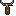

# Оружие

Семь fantasy-оружий, которые можно поднять с пола или найти в сундуках. Каждый следующий этаж повышает шанс встретить оружие получше.

Три роли: **warrior** (ближний бой), **archer** (лук/арбалет), **mage** (жезл/посох). Формулы DPS упрощённые — они игнорируют разброс и hitbox шейпы.

## Warrior — ближний бой

| Оружие | Спрайт | Damage | Interval | Reach | Дуга | Knockback | Base DPS |
|--------|--------|-------:|---------:|------:|-----:|----------:|---------:|
| Кинжал |  | 1 | 0.28 s | 24 | 60° | 10 | 3.57 |
| Короткий меч |  | 2 | 0.38 s | 34 | 80° | 40 | 5.26 |
| Копьё |  | 2 | 0.48 s | 58 | thrust | 30 | 4.17 |

### Кинжал

Самый быстрый и с самой короткой дистанцией. Одиночный удар слабый, но 3.5 удара в секунду добавляют. Лучше всего откликается на карту `Heavy Strike` (+1 damage за стак): при трёх стеках DPS вырастает с 3.57 до ~14.

**Когда брать:** играешь агрессивно, готов подходить вплотную; хочешь максимальный DPS в обмен на минимальный reach.

### Короткий меч

Универсальное оружие. Умеренный интервал, средний reach, широкая дуга и приличный knockback. Стартовое оружие после смерти.

**Когда брать:** всегда безопасный выбор.

### Копьё

Самое длинное melee-оружие. Не рубит по дуге, а выполняет thrust — узкий прямоугольник от игрока вперёд. Позволяет бить, не подходя вплотную.

Карта `Sweeping Blade` (расширение дуги) на копьё не действует и **не будет предлагаться** — генератор офферов знает, что thrust не имеет дуги. Остальные warrior-карты (`Heavy Strike`, `Long Reach`, `Pushback`) работают.

**Когда брать:** нужно safe-poking'нуть орка или паука с дистанции, не рисковать контактом.

## Archer — дальний бой

| Оружие | Спрайт | Damage | Interval | Speed | Spread | Pierce | DPS |
|--------|--------|-------:|---------:|------:|-------:|-------:|----:|
| Короткий лук |  | 1 | 0.32 s | 260 | 2° | 0 | 3.13 |
| Арбалет |  | 3 | 0.75 s | 300 | 0° | 1 | 4.00 |

### Короткий лук

Быстрый и точный. Разброс 2° — почти не мажет.

**Когда брать:** ровный поток урона на дистанции, без риска ближнего боя.

### Арбалет

Медленно, но сильно. Пробивает одного врага насквозь (`pierce = 1`) — залп в двух врагов подряд.

**Когда брать:** против жирных боссов или колонн врагов на одной линии.

## Mage — магия

| Оружие | Спрайт | Damage | Interval | Speed | Spread | DPS |
|--------|--------|-------:|---------:|------:|-------:|----:|
| Жезл |  | 1 | 0.24 s | 230 | 4° | 4.17 |
| Посох ученика |  | 3 | 0.62 s | 210 | 0° | 4.84 |

### Жезл

Часто, много, но каждый заряд слабый. Небольшой разброс — не всегда бьёт в лоб.

**Когда брать:** быстрый спам магии по мелким врагам.

### Посох ученика

Тяжёлый одиночный cast. Медленно, но каждый выстрел жалит.

**Когда брать:** есть уверенность в прицеле; надо снимать big HP-пулы.

---

## Что берётся из чего

Оружие выпадает из:
- **Сундуков** — раз в несколько этажей на этаже появляется сундук, внутри — оружие или зелье. Сундук всегда выдаёт оружие, отличное от твоего текущего.
- **Убитых врагов** — редко, шанс невелик.
- **Стартовый инвентарь** — короткий меч.

Больше деталей про drop chance и логику chest — в [docs/gamedesign/pickups.md](../gamedesign/pickups.md) и [docs/gamedesign/weapons.md](../gamedesign/weapons.md).

---

*Параметры взяты из `resources/weapons/*.tres`; кроме damage/attack_interval прогрессия использует ещё tier-масштабирование через `Balance` и warrior/archer/mage upgrade cards.*
